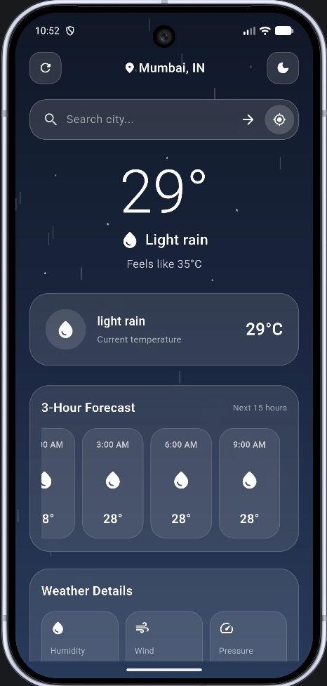

# Weatherly 🌤️

A simple and modern weather application built with Flutter that provides current weather information and hourly forecasts using the OpenWeather API.

## 📱 Screenshots

<p align="center">
  
</p>

## ✨ Features

- 🌡️ Current temperature
- 🌤️ Current weather condition
- 📍 Location-based weather information
- 🕐 Hourly weather forecast
- 💧 Humidity information
- 💨 Wind speed information
- 🌡️ Atmospheric pressure
- 🔄 Refresh weather data
- ⏳ Loading state
- ⚠️ Error handling
- 📱 Responsive Flutter UI

## 🛠️ Tech Stack

- **Flutter**
- **Dart**
- **OpenWeather API**
- **HTTP / REST API**
- **Material Design**

## 📂 Project Structure

```text
lib/
├── main.dart
├── weather_screen.dart
├── addinfo.dart
└── hourinfo.dart

screenshots/
└── weatherly-main.png
```

## 🚀 Getting Started

### Prerequisites

Make sure you have the following installed:

- Flutter SDK
- Dart SDK
- Android Studio or VS Code
- Android device or emulator
- OpenWeather API key

### 1. Clone the Repository

```bash
git clone https://github.com/Pranay-Pandurang-Patil/Weatherly.git
```

### 2. Navigate to the Project

```bash
cd Weatherly
```

### 3. Install Dependencies

```bash
flutter pub get
```

### 4. Configure the API Key

Add your OpenWeather API key to the appropriate project configuration.

> **Important:** Never commit your API key or other sensitive credentials to GitHub.

### 5. Run the Application

```bash
flutter run
```

## 📦 Build APK

To generate a release APK:

```bash
flutter build apk --release
```

The generated APK will be available at:

```text
build/app/outputs/flutter-apk/app-release.apk
```

## 🔐 API

Weatherly uses the **OpenWeather API** to retrieve weather information.

API provider:

https://openweathermap.org/api

> **Security Note:** API keys should be stored securely and should not be committed to a public repository.

## 🎯 Purpose

Weatherly was created as a Flutter learning project to practice:

- Flutter UI development
- Dart programming
- REST API integration
- JSON data handling
- Asynchronous programming
- Loading and error state management
- Mobile application development

## 📸 Project Preview

Weatherly provides weather information through a clean and simple interface designed for quick access to important weather details.

## 👨‍💻 Author

**Pranay Pandurang Patil**

GitHub:

https://github.com/Pranay-Pandurang-Patil/Weatherly

## 🙏 Acknowledgements

- [Flutter](https://flutter.dev/)
- [Dart](https://dart.dev/)
- [OpenWeather](https://openweathermap.org/)

---

If you find this project useful, consider giving the repository a ⭐ on GitHub.
